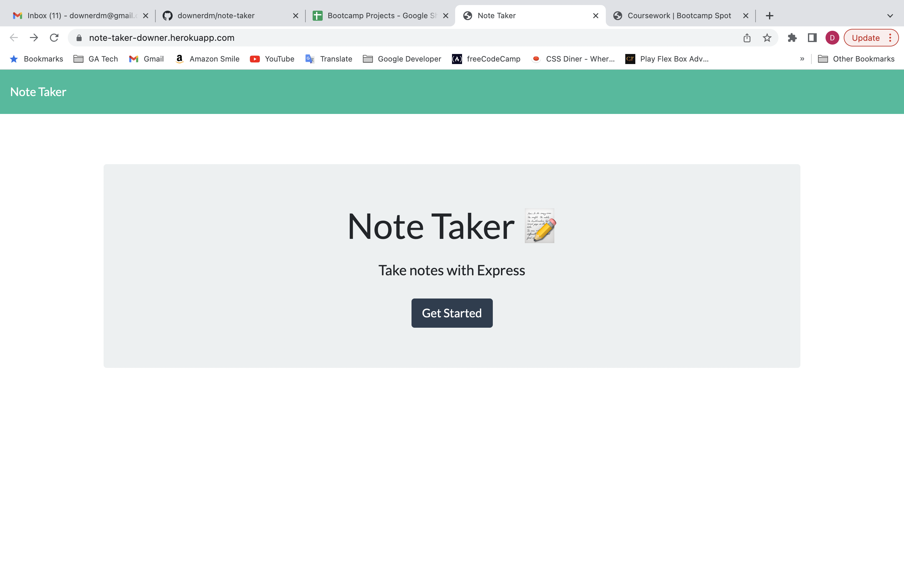
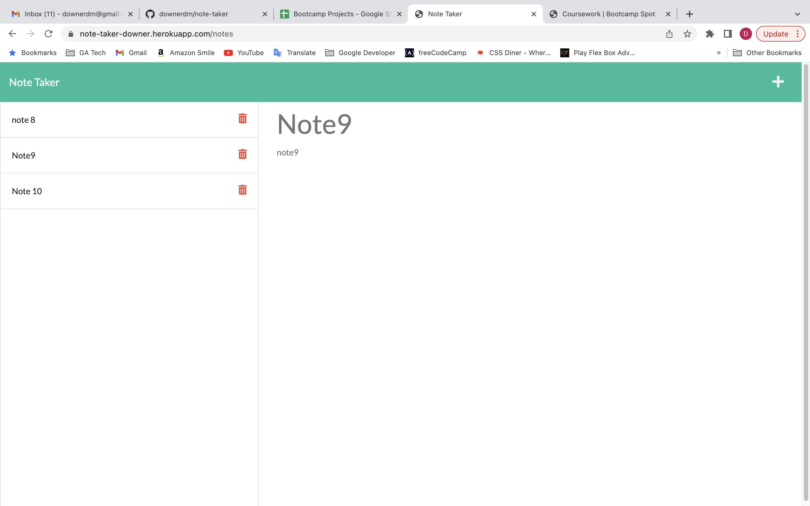

# Note Taker

## Your Task

The assignment was to modify starter code to create an application called Note Taker that can be used to write and save notes. This application uses an Express.js back end and will save and retrieve note data from a JSON file.

My task was to build the back end, connect the two, and then deploy the entire application to Heroku.

On the back end, the application includes a `db.json` file that will be used to store and retrieve notes using the `fs` module.

The following HTML routes were created:

* `GET /notes` returns the `notes.html` file.

* `GET *` returns the `index.html` file.

The following API routes were created:

* `GET /api/notes` reads the `db.json` file and returns all saved notes as JSON.

* `POST /api/notes` receives a new note to save on the request body, adds it to the `db.json` file, and then returns the new note to the client. Each note is given a unique id when it's saved.

The original User Story and Acceptance Criteria were as follows:

## User Story

```
AS A small business owner
I WANT to be able to write and save notes
SO THAT I can organize my thoughts and keep track of tasks I need to complete
```


## Acceptance Criteria

```
GIVEN a note-taking application
WHEN I open the Note Taker
THEN I am presented with a landing page with a link to a notes page
WHEN I click on the link to the notes page
THEN I am presented with a page with existing notes listed in the left-hand column, plus empty fields to enter a new note title and the note’s text in the right-hand column
WHEN I enter a new note title and the note’s text
THEN a Save icon appears in the navigation at the top of the page
WHEN I click on the Save icon
THEN the new note I have entered is saved and appears in the left-hand column with the other existing notes
WHEN I click on an existing note in the list in the left-hand column
THEN that note appears in the right-hand column
WHEN I click on the Write icon in the navigation at the top of the page
THEN I am presented with empty fields to enter a new note title and the note’s text in the right-hand column
```


## Screenshots

Note Taker Launch Screen


Note Taker Notes Screen


## Link to Deployed Application

<https://note-taker-downer.herokuapp.com/>
